# 推荐算法说明文档

## 1. 算法概述

蔡品检的智能推荐引擎采用**基于用户画像的多维度加权评分算法**，结合**多样性约束**和**时间去重策略**，为用户生成个性化且营养均衡的菜谱组合。

### 1.1 设计目标

- ✅ **个性化** - 根据用户偏好精准推荐
- ✅ **多样性** - 避免食材、烹饪方法、菜系重复
- ✅ **营养均衡** - 保证推荐菜品的营养互补
- ✅ **新鲜感** - 7天内不重复推荐
- ✅ **容错性** - 候选池不足时的降级策略

---

## 2. 推荐流程

```mermaid
flowchart TD
    Start[开始请求] --> Type{请求类型?}
    
    Type -->|直接推荐| GetProfile[获取用户画像]
    Type -->|对话式建议| ParsePref[解析对话偏好]
    
    ParsePref --> HasPref{是否有偏好?}
    HasPref -->|是| UpdateDB[更新画像权重]
    UpdateDB --> Redirect[重定向需求关键词]
    Redirect --> GetProfile
    HasPref -->|否| GetProfile

    GetProfile --> GetHistory[获取7天历史记录]
    GetHistory --> FilterCandidates[过滤候选池]
    
    FilterCandidates --> CheckEmpty{候选池是否为空?}
    CheckEmpty -->|是| AI_Fallback[AI生成兜底]
    CheckEmpty -->|否| Scoring[多维度加权评分]
    
    Scoring --> Sort[按评分降序排序]
    Sort --> DiversityFilter[多样性约束选择]
    
    DiversityFilter --> CheckCount{满足数量?}
    CheckCount -->|否| Relax[放宽多样性限制]
    Relax --> SelectMore[选择高分菜品]
    CheckCount -->|是| Format[格式化并注入提示]
    SelectMore --> Format
    
    Format --> Return[返回推荐结果]
    AI_Fallback --> Return
```



---

## 3. 多维度评分算法

### 3.1 评分公式

对于每道候选菜谱，计算综合评分：

```
总分 = 菜系分 × 2.0 + 口味分 × 1.5 + 烹饪方法分 × 1.2 + 营养分 × 1.0 + 食材分 × 1.0
```

#### 3.1.1 菜系评分
```javascript
if (菜谱菜系 in 用户菜系权重) {
  菜系分 = 用户菜系权重[菜谱菜系] × 2.0  // 最高权重
}
```

**示例**:
- 用户川菜权重 = 0.8
- 菜谱菜系 = "川菜"
- 菜系分 = 0.8 × 2.0 = **1.6**

#### 3.1.2 口味评分
```javascript
口味分 = Σ (用户口味权重[标签] × 1.5) for 标签 in 菜谱口味标签
```

**示例**:
- 菜谱口味标签 = ["辣", "咸"]
- 用户权重: 辣=0.7, 咸=0.6
- 口味分 = (0.7 + 0.6) × 1.5 = **1.95**

#### 3.1.3 烹饪方法评分
```javascript
烹饪方法分 = Σ (用户烹饪方法权重[方法] × 1.2) for 方法 in 菜谱烹饪方法
```

#### 3.1.4 营养评分
```javascript
营养分 = Σ (用户营养权重[标签] × 1.0) for 标签 in 菜谱营养标签
```

#### 3.1.5 食材评分
```javascript
食材分 = Σ (用户食材权重[食材] × 1.0) for 食材 in 菜谱主食材(前3个)
```

### 3.2 评分权重设计理念

| 维度 | 权重系数 | 理由 |
|------|---------|------|
| 菜系 | 2.0 | 菜系偏好通常最稳定，是用户选择的首要因素 |
| 口味 | 1.5 | 口味是核心体验，但可能跨菜系 |
| 烹饪方法 | 1.2 | 影响菜品口感和健康，重要性中等 |
| 营养 | 1.0 | 长期健康考量，基础权重 |
| 食材 | 1.0 | 用户可能不清楚具体食材偏好，基础权重 |

---

## 4. 多样性约束

### 4.1 三重约束机制

为避免推荐结果单一，引入以下约束：

#### 4.1.1 食材多样性
```javascript
主食材重复检查: 
  if (菜谱主食材(前2个) ∩ 已选菜品主食材 ≠ ∅) {
    跳过该菜谱
  }
```

**目的**: 避免"鸡肉套餐"（3道菜都是鸡肉）

#### 4.1.2 烹饪方法多样性
```javascript
烹饪方法重复检查:
  if (菜谱所有烹饪方法 ⊆ 已选烹饪方法集合) {
    跳过该菜谱
  }
```

**目的**: 避免"油炸套餐"（3道菜都是油炸）

#### 4.1.3 菜系多样性
```javascript
菜系重复检查:
  if (同菜系已选菜品数量 >= 2) {
    跳过该菜谱
  }
```

**目的**: 鼓励探索不同菜系（但允许最多2道同菜系）

### 4.2 多样性约束伪代码

```python
selected_recipes = []
used_ingredients = set()
used_cooking_methods = set()
used_cuisines = []

for candidate in sorted_candidates:
    if len(selected_recipes) >= target_count:
        break
    
    # 检查食材冲突
    main_ingredients = candidate.ingredients[:2]
    if any(ing in used_ingredients for ing in main_ingredients):
        continue
    
    # 检查烹饪方法冲突
    if all(method in used_cooking_methods for method in candidate.cooking_methods):
        continue
    
    # 检查菜系冲突
    cuisine_count = used_cuisines.count(candidate.cuisine)
    if cuisine_count >= 2:
        continue
    
    # 通过所有约束，选择该菜谱
    selected_recipes.append(candidate)
    used_ingredients.update(main_ingredients)
    used_cooking_methods.update(candidate.cooking_methods)
    used_cuisines.append(candidate.cuisine)
```

---

## 5. 异常处理与降级策略

### 5.1 候选池不足

**场景**: 多样性约束过严，选出的菜品数量 < 目标数量

**策略**:
```javascript
if (selected_recipes.length < target_count) {
  console.log("⚠️ 放宽多样性限制");
  
  // 忽略多样性约束，直接按评分选择
  for (candidate in sorted_candidates) {
    if (selected_recipes.length >= target_count) break;
    if (!已选择(candidate)) {
      selected_recipes.push(candidate);
    }
  }
}
```

### 5.2 候选池为空

**场景**: 7天历史过滤后，没有可用菜谱

**策略**:
```javascript
if (candidates.length === 0) {
  return {
    error: "候选菜谱池为空，请添加更多基础菜谱"
  };
}
```

**建议**: 定期运行爬虫补充菜谱库

### 5.3 用户画像缺失

**场景**: 新用户没有画像数据

**策略**:
```javascript
if (!user_profile) {
  // 自动创建默认画像（所有权重 = 0.5）
  await initializeDefaultProfile(userId);
}
```

---

## 6. 7天不重复逻辑

### 6.1 实现机制

```javascript
const sevenDaysAgo = Date.now() - 7 * 24 * 60 * 60 * 1000;
const recentHistory = await db.query(`
  SELECT id FROM history 
  WHERE created_at > ? 
  ORDER BY created_at DESC
`, [sevenDaysAgo]);

const excludeIds = [...recentHistory.map(r => r.id), ...userProvidedExcludeIds];

const candidates = await db.query(`
  SELECT * FROM base_recipes 
  WHERE id NOT IN (${excludeIds.join(',')})
`);
```

### 6.2 设计考量

- **时间窗口**: 7天（可配置）
- **排除来源**:
  1. 历史推荐记录（`history` 表）
  2. 用户手动排除的菜谱
- **目的**: 保证用户每周都有新鲜体验

---

## 7. 性能优化

### 7.1 数据库索引

```sql
CREATE INDEX idx_base_recipes_cuisine_type ON base_recipes(cuisine_type);
CREATE INDEX idx_user_feedback_created_at ON user_feedback(created_at);
```

### 7.2 评分计算优化

- 使用 JavaScript 原生对象而非数据库JOIN
- 评分计算在内存中完成，避免多次数据库查询

### 7.3 缓存策略（未来优化）

```javascript
// 缓存用户画像，避免每次推荐都查询数据库
const cachedProfile = cache.get(`user_profile:${userId}`);
if (!cachedProfile) {
  cachedProfile = await db.getUserProfile(userId);
  cache.set(`user_profile:${userId}`, cachedProfile, 60); // 缓存60秒
}
```

---

## 8. 推荐结果示例

### 8.1 输入
```json
{
  "userId": "peter_yong",
  "diners": 3,
  "excludeRecipeIds": []
}
```

### 8.2 输出
```json
{
  "id": "rec-uuid-123",
  "title": "蔡大厨精选套餐·宫保鸡丁等3道",
  "cuisine": "川菜",
  "diners": 3,
  "dishes": [
    {
      "name": "宫保鸡丁",
      "ingredients": [...],
      "instructions": [...]
    },
    {
      "name": "清蒸鲈鱼",
      "ingredients": [...],
      "instructions": [...]
    },
    {
      "name": "蒜蓉西兰花",
      "ingredients": [...],
      "instructions": [...]
    }
  ],
  "nutritionInfo": "💡 根据您的偏好智能推荐 3 道菜，已确保食材多样、烹饪方式均衡、营养互补",
  "tags": ["川菜", "海鲜", "素菜", "清淡"],
  "createdAt": 1738502400000
}
```

### 8.3 多样性验证

| 菜品 | 主食材 | 烹饪方法 | 菜系 |
|-----|-------|---------|------|
| 宫保鸡丁 | 鸡肉, 花生 | 煎炒 | 川菜 |
| 清蒸鲈鱼 | 鲈鱼 | 蒸煮 | 粤菜 |
| 蒜蓉西兰花 | 西兰花 | 蒸煮, 炒 | 家常菜 |

✅ 主食材无重复  
✅ 烹饪方法多样（煎炒、蒸煮）  
✅ 菜系分布合理（川菜、粤菜、家常菜）

---

## 9. 算法调优建议

### 9.1 调整评分权重

如果发现推荐结果过于集中在某一菜系：
```javascript
// 降低菜系权重系数
const cuisineScore = profile.cuisineWeights[recipe.cuisine_type] * 1.5; // 从2.0降到1.5
```

### 9.2 调整多样性阈值

如果总是触发"放宽限制"：
```javascript
// 放宽菜系重复限制
const hasCuisineConflict = cuisineCount >= 3; // 从2改为3
```

### 9.3 调整权重学习速率

如果用户偏好变化太快：
```javascript
// 降低单次反馈的影响
const delta = feedbackType === 'like' ? 0.05 : -0.02; // 从0.1/-0.05降到0.05/-0.02
```

---

## 10. 测试用例

### 10.1 正常场景

**输入**: 用户喜欢川菜（权重0.8），2人用餐  
**预期**: 推荐2道川菜相关菜品，食材和烹饪方法多样

### 10.2 边界场景

**输入**: 候选池只有5道菜，需要推荐3道  
**预期**: 成功推荐3道菜（可能触发放宽限制）

### 10.3 异常场景

**输入**: 候选池为空  
**预期**: 返回错误信息"候选菜谱池为空"

---

## 12. 对话式偏好动态调整 (Update & Redirect)

### 12.1 核心逻辑

当用户在对话框输入非特定菜名（如“我喜欢吃辣的”）时，系统不再只是简单的“更新配置”，而是执行 **“更新权重 + 需求重定向”** 的组合拳。

1. **解析 (Parse)**: 使用 AI 识别对话中的味型、菜系调整意图。
2. **应用 (Apply)**: 立即更新数据库中 `user_profile` 的相应权重。
3. **重定向 (Redirect)**: 将用户的原始对话（偏好描述）提取为关键词（如“辣”），并将其作为本次推荐的新需求传入推荐引擎。
4. **注入 (Inject)**: 在最终返回的菜谱 `nutritionInfo` 字段中注入偏好更新的成功提示。

### 12.2 用户体验映射

| 用户操作 | 后端处理 | 前端反馈 |
|---------|---------|---------|
| 输入“我喜欢吃川菜” | 更新川菜权重 -> 重定向搜“川菜” | 看到“✅ 已增加川菜偏好” + 一套川菜推荐 |
| 输入“不要太油腻” | 降低“油炸”权重 -> 重定向搜“清淡” | 看到“✅ 已降低油炸偏好” + 清淡健康的推荐 |

---

## 13. AI 辅助数据标注 (Data Enrichment)

为提升本地算法的准确性，系统支持通过 AI 对存量菜谱进行“画像标注”：
- **自动推断**: 根据菜名和现有标签推断其所属菜系、主味型（酸甜苦辣咸麻鲜）。
- **字段补全**: 补全 `cuisine_type`, `taste_tags`, `cooking_methods`, `nutrition_tags` 字段。
- **运行方式**: 运行 `node server/scripts/migrate_db.js` 或专用脚本。
