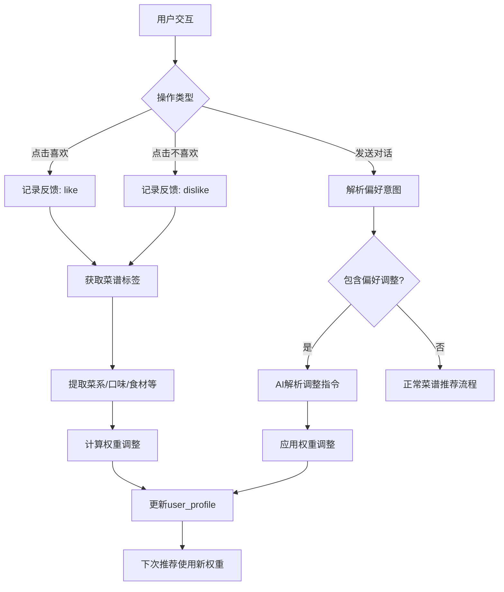

# 用户画像系统设计文档

## 1. 系统概述

用户画像系统是蔡品检智能推荐引擎的核心组件，通过持续学习用户的饮食偏好，提供个性化的菜谱推荐。

### 1.1 核心特性

- **多维度偏好建模** - 从菜系、口味、食材、烹饪方法、营养等5个维度建立用户画像
- **动态权重调整** - 基于用户反馈（喜欢/不喜欢）自动调整权重
- **对话式参数调整** - 支持通过自然语言调整偏好（如"我想少吃点辣的"）
- **渐进式学习** - 权重在0.1-1.0范围内平滑调整，避免剧烈波动

---

## 2. 权重系统架构

### 2.1 五维权重模型

```javascript
{
  "taste_weights": {        // 口味权重
    "甜": 0.5,
    "咸": 0.5,
    "辣": 0.5,
    "酸": 0.5,
    "鲜": 0.5,
    "麻": 0.5,
    "苦": 0.5
  },
  "cuisine_weights": {      // 菜系权重
    "川菜": 0.5,
    "粤菜": 0.5,
    "湘菜": 0.5,
    "鲁菜": 0.5,
    // ...
  },
  "ingredient_weights": {   // 食材权重（动态扩展）
    "鸡胸肉": 0.6,
    "土豆": 0.7,
    // 用户接触新食材时自动添加
  },
  "cooking_method_weights": {  // 烹饪方法权重
    "油炸": 0.4,
    "煎炒": 0.6,
    "炖煮": 0.7,
    "蒸煮": 0.8,
    "烤制": 0.5,
    "凉拌": 0.6,
    "煲汤": 0.7
  },
  "nutrition_weights": {    // 营养偏好权重
    "蛋白质": 0.6,
    "脂肪": 0.4,
    "碳水化合物": 0.5,
    "维生素": 0.7,
    "矿物质": 0.6,
    "膳食纤维": 0.7
  }
}
```

###2.2 权重初始化

- **默认值**: 所有权重初始化为 `0.5`（中性偏好）
- **范围限制**: `0.1 ≤ weight ≤ 1.0`
- **语义**:
  - `0.1-0.3`: 不喜欢
  - `0.4-0.6`: 中性
  - `0.7-1.0`: 喜欢

---

## 3. 学习机制

### 3.1 基于反馈的学习

#### 喜欢操作 (`like`)
```javascript
delta = +0.1
new_weight = min(1.0, old_weight + delta)
```

**影响范围**:
- 菜谱的菜系权重 +0.1
- 菜谱的所有口味标签权重 +0.1
- 菜谱的烹饪方法权重 +0.1
- 菜谱的营养标签权重 +0.1
- 菜谱的主食材（前3个）权重 +0.1

#### 不喜欢操作 (`dislike`)
```javascript
delta = -0.05
new_weight = max(0.1, old_weight + delta)
```

**设计理念**:
- 正反馈力度大于负反馈（+0.1 vs -0.05）
- 避免过度惩罚（单次不喜欢不应完全封杀某类菜品）

### 3.2 对话式偏好调整

用户可以通过自然语言表达偏好调整：

| 用户输入 | 解析结果 |
|---------|---------|
| "我更喜欢川菜" | `cuisine_weights["川菜"] += 0.2` |
| "不要那么辣" | `taste_weights["辣"] -= 0.2` |
| "多一些海鲜" | `ingredient_weights["海鲜"] += 0.15` |
| "少油炸，多清蒸" | `cooking_method_weights["油炸"] -= 0.2`<br/>`cooking_method_weights["蒸煮"] += 0.2` |

**实现流程**:
1. 用户发送对话消息
2. DeepSeek AI 解析意图 → 提取调整指令
3. 应用权重调整到用户画像
4. 返回确认消息
5. 下次推荐即刻生效

---

## 4. 数据库Schema

### 4.1 `user_profile` 表

| 字段 | 类型 | 说明 |
|-----|------|------|
| `user_id` | TEXT PRIMARY KEY | 用户ID（目前固定为 `peter_yong`） |
| `taste_weights` | TEXT (JSON) | 口味权重 |
| `cuisine_weights` | TEXT (JSON) | 菜系权重 |
| `ingredient_weights` | TEXT (JSON) | 食材权重 |
| `cooking_method_weights` | TEXT (JSON) | 烹饪方法权重 |
| `nutrition_weights` | TEXT (JSON) | 营养偏好权重 |
| `updated_at` | INTEGER | 最后更新时间（毫秒时间戳） |

### 4.2 `user_feedback` 表

| 字段 | 类型 | 说明 |
|-----|------|------|
| `id` | TEXT PRIMARY KEY | 反馈ID（UUID） |
| `user_id` | TEXT | 用户ID |
| `recipe_id` | TEXT | 菜谱ID |
| `feedback_type` | TEXT | 反馈类型（`like` / `dislike`） |
| `created_at` | INTEGER | 反馈时间（毫秒时间戳） |

**索引**:
- `idx_user_feedback_user_id` on `user_id`
- `idx_user_feedback_recipe_id` on `recipe_id`
- `idx_user_feedback_created_at` on `created_at`

---

## 5. API接口

### 5.1 获取用户画像
```http
GET /api/user-profile/:userId
```

**响应示例**:
```json
{
  "userId": "peter_yong",
  "tasteWeights": { "甜": 0.5, "辣": 0.7, ... },
  "cuisineWeights": { "川菜": 0.8, "粤菜": 0.6, ... },
  "ingredientWeights": { "鸡胸肉": 0.7, ... },
  "cookingMethodWeights": { "蒸煮": 0.8, ... },
  "nutritionWeights": { "蛋白质": 0.7, ... },
  "updatedAt": 1738502400000
}
```

### 5.2 更新用户画像
```http
POST /api/user-profile/:userId
Content-Type: application/json

{
  "tasteWeights": { ... },
  "cuisineWeights": { ... },
  "ingredientWeights": { ... },
  "cookingMethodWeights": { ... },
  "nutritionWeights": { ... }
}
```

### 5.3 记录用户反馈
```http
POST /api/user-feedback
Content-Type: application/json

{
  "userId": "peter_yong",
  "recipeId": "recipe-uuid",
  "feedbackType": "like" | "dislike"
}
```

**副作用**: 自动触发权重更新机制

---

## 6. 工作流程示意图



---

## 7. 最佳实践

### 7.1 权重平衡
- 避免单一维度权重过高（如所有川菜权重都是1.0），会导致推荐缺乏多样性
- 建议保持各维度权重分布合理，允许用户探索新口味

### 7.2 异常处理
- 如果用户画像不存在，应自动创建默认画像
- 权重调整时应确保不超出 [0.1, 1.0] 范围

### 7.3 隐私考量
- 目前单用户系统（`peter_yong`）
- 未来多用户扩展时，需确保画像数据隔离

---

## 8. 未来优化方向

1. **协同过滤** - 引入相似用户的偏好作为冷启动参考
2. **时间衰减** - 降低较早反馈的权重，突出近期偏好
3. **场景感知** - 根据时间、季节、节日调整推荐策略
4. **A/B测试** - 对比不同权重算法的推荐效果
